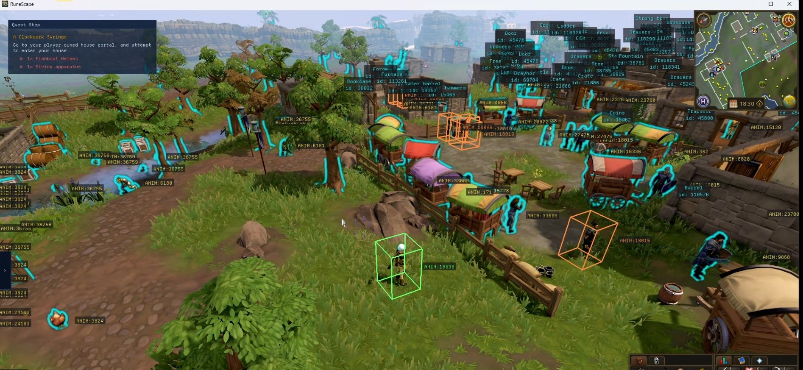
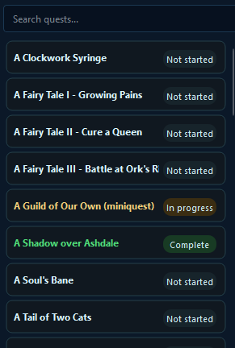
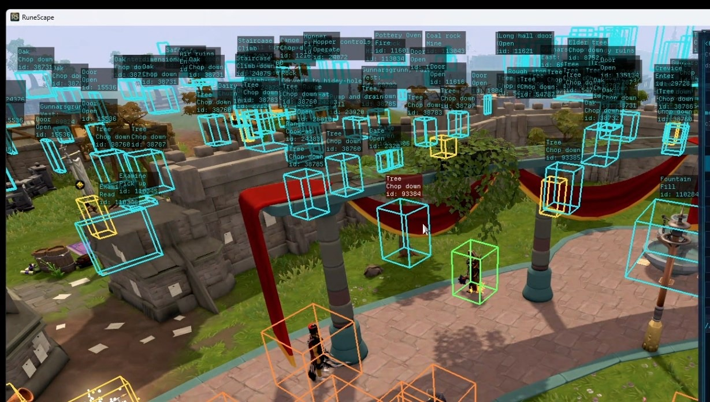
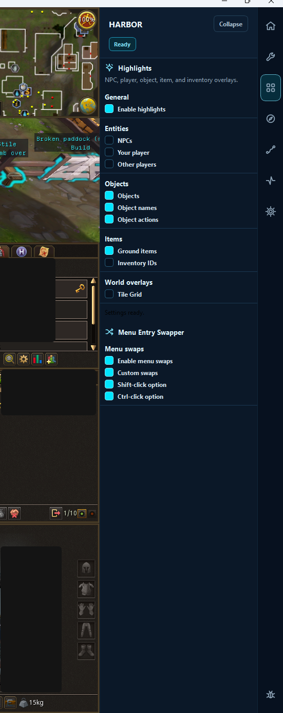
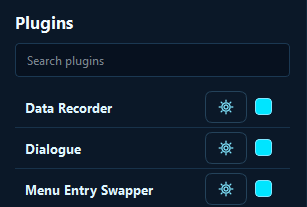
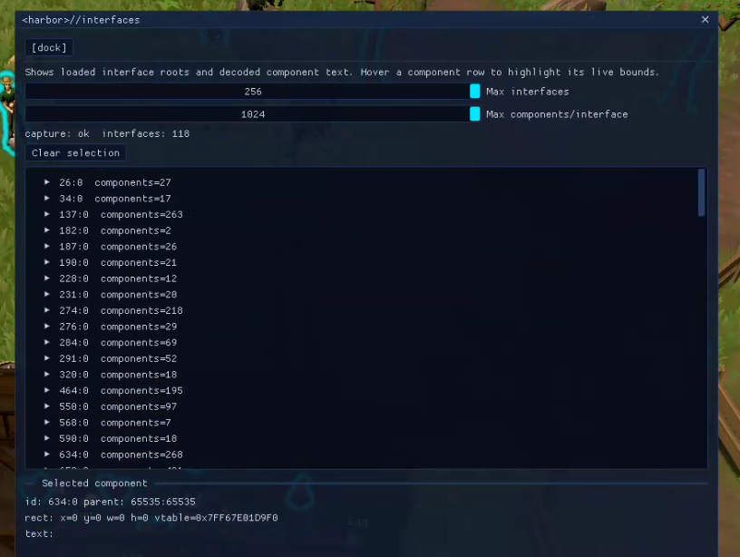
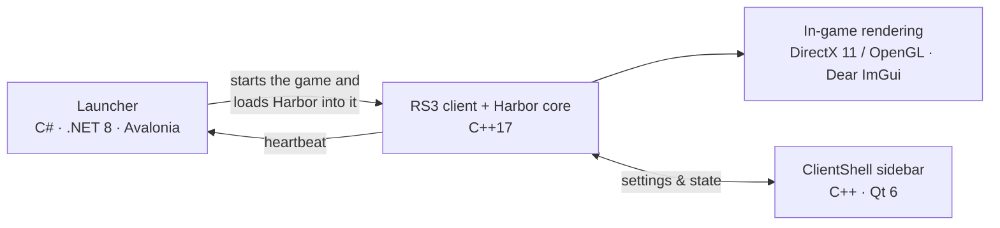

# Harbor

**A RuneLite-inspired quality-of-life client for RuneScape 3.**

Harbor brings the kind of player-facing help that [RuneLite](https://runelite.net) gives Old School RuneScape (quest guidance, highlights, menu swaps, a plugin sidebar) to RuneScape 3's native C++ client.

> **This repository is a project write-up, not the source.** The code is private on purpose; see [Why there's no source code](#why-theres-no-source-code). What's here explains what Harbor does, how it's built, and what made it hard.


<sub>The Quest Helper step card (top left) listing the current step and its item requirements, with in-world object and NPC highlights plus developer ID labels.</sub>

---

## Why Harbor exists

RuneLite changed how people play Old School RuneScape. Its plugins, especially [Quest Helper](https://github.com/Zoinkwiz/quest-helper), Menu Entry Swapper, and NPC and object indicators, turned a lot of tedious clicking and wiki-tab juggling into something the client just handles for you.

RuneScape 3 players never got an equivalent built into the game client. RS3 has good tools that work by reading the screen, but nothing that plugs into the client itself the way RuneLite does. Harbor set out to fill that gap: the same RuneLite-style quality-of-life plugins, rebuilt for RS3.

## Why it's harder than RuneLite

RuneLite builds on the OSRS client, which is written in Java. RS3 runs on **NXT**, a native C++ engine, so none of RuneLite's approach carries over:

| | RuneLite (OSRS) | Harbor (RS3) |
|---|---|---|
| Game client | Java | Native C++ (NXT engine) |
| Getting inside the client | Java classpath / client modification | A native C++ module loaded into the running game |
| Game state | Java objects with readable names | Native engine structures that have to be reverse-engineered |
| Drawing overlays | Java rendering inside the client | Hooking the game's own DirectX 11 / OpenGL frame |
| Surviving game updates | Mappings maintained by the RuneLite project | Pattern-based lookups re-verified against each new build |

Every feature RuneLite gets from a Java API, Harbor first had to find in a compiled C++ engine, understand, verify, and then keep working as the game updates.

---

## Features

### Quest Helper



Modelled on RuneLite's Quest Helper:

- **Quest list** built from the game's own quest data, searchable and colour-coded by status (not started, in progress, complete).
- **Step-by-step guide** that shows the current step and what you need for it, with item requirements checked live against what you're carrying.
- **Progress detection** driven by the game's own quest progress variables, so the helper follows along as you play instead of relying on manual check-offs. Harbor decodes the client's variable definitions (more than 18,000 of them) directly from the running game.
- **Selective highlighting** of the NPC, object, or item that matters for the current step.

*Status: in active development.*

<br clear="right">

### Highlights



NPC, object, and ground-item indicators in the spirit of RuneLite's indicator plugins. Interactable objects get in-scene outlines labelled with their name and available actions, and NPCs get model-aligned boxes. Everything is drawn *inside the game's 3D scene*, correctly positioned and depth-tested, not as a flat overlay pasted on top.

### Menu Entry Swapper

RuneLite-style left-click and shift-click swaps for RS3's right-click menu, plus custom swap rules with Shift/Ctrl modifiers. Harbor only ever **reorders or selects entries the game itself built**; it never invents menu actions the normal client couldn't produce.

### ClientShell: a RuneLite-style sidebar

<table>
<tr>
<td width="320"></td>
<td valign="top">

Early builds put all their settings in an in-game overlay. The **ClientShell** moves them into a proper desktop sidebar next to the game window, the same layout RuneLite players are used to:

- The game window is embedded in a Qt 6 shell.
- A plugin list with a settings cog and on/off toggle per plugin.
- Per-plugin configuration panels (Highlights and Menu Entry Swapper shown here).



</td>
</tr>
</table>

### Developer tools



Like RuneLite's Developer Tools plugin, Harbor ships in-game inspectors for building new plugins. This one lists every loaded game interface and its components; hovering a row highlights that component's live bounds on screen. Developer tooling is compiled out of player builds.

---

## How it works



- **Launcher** (C#, Avalonia, .NET 8): finds or starts RS3, loads Harbor's core into the game, and watches a heartbeat to confirm Harbor is alive before reporting success. It also manages updates.
- **Core** (C++17): runs inside the game. It waits until the game's renderer is fully up before attaching to it, which avoids fighting the engine during startup. From then on it draws Harbor's overlays and in-world graphics as part of each frame, using Dear ImGui for UI and native OpenGL shaders for 3D markers.
- **ClientShell** (C++, Qt 6): the player-facing desktop UI around the game window.

### Architecture: three tiers, one rule

The core is split into three layers, and dependencies may only point **downward**:

```text
modules/    player features: quest helper, highlights, menu entry swapper, ...
   ↓
api/        shared surfaces: game state, world, rendering, actions
   ↓
platform/   the substrate: rendering hooks, UI, IPC, settings, engine structure definitions
```

Modules never call each other; anything shared goes through an `api/` surface. This works like RuneLite's plugin model: each feature is self-contained and can be removed without breaking the others. CI enforces the rule by linting includes.

### Reverse engineering, done carefully

Everything Harbor knows about the engine lives in one place: a set of YAML definitions describing engine types, fields, functions, and globals.

- **Nothing is trusted until it's proven.** A finding from static analysis in IDA Pro stays a *candidate* until it's confirmed live against the running game, and only then is it marked verified.
- **The C++ code is generated from the YAML.** A code generator writes the C++ struct headers with compile-time checks on every field's position and size. CI fails if the generated headers and the definitions ever drift apart.
- **Built to survive game updates.** Functions are located by byte patterns instead of hard-coded addresses, and a scheduled job re-checks every pattern against archived game builds to flag anything an update broke.

By the numbers (August 2026): **165** engine types, **952** fields, and **171** functions mapped, with **446** fields and **110** functions live-verified, tracked across **7** archived game builds.

---

## Engineering highlights

- **158K lines of C++17** in the core, plus a C# launcher, a Qt shell, and Python tooling.
- **Performance work:** with Harbor attached, frame rate dropped from 160 to 100 FPS (+3.75 ms per frame). Profiling traced it to a diagnostic hook firing about 4,300 times per frame. Removing it from player builds recovers an estimated 3 ms per frame.
- **Tested on real Windows machines:** merges are gated on self-hosted Windows CI. The suites cover **7,261** C++ test assertions, **2,446** Python tests, and **295** .NET tests, plus the architecture and code-generation drift checks.
- **Safety rules built into the design:** Harbor never forges network traffic or sends anything the normal game client couldn't send. Menu features reuse the game's own actions, and developer tooling is compiled out of player builds, with CI checking that it stays out.

## Tech stack

| Area | Technology |
|---|---|
| Core | C++17, MSVC / clang-cl, CMake, Ninja |
| Rendering | DirectX 11 (DXGI), OpenGL, GLSL, Dear ImGui, MinHook |
| Desktop UI | Qt 6 (ClientShell), C# / .NET 8 / Avalonia (launcher) |
| Reverse engineering | IDA Pro, BinSync, Zydis, custom YAML → C++ code generator (Python) |
| CI | GitHub Actions on self-hosted Windows runners, pytest, xUnit |

---

## Why there's no source code

The same engine-level access that makes quality-of-life plugins possible could also be used for things that hurt other players, like automation and unfair advantages. Publishing the source, the engine mappings, or builds would make that easy, so they stay private.

This write-up exists to show the engineering: the design, the architecture, and the reverse-engineering process, without handing anyone a toolkit. For the same reason there are no download links.

## Credits & disclaimer

- **Lead developer:** Brett Bargay ([@Manokit](https://github.com/Manokit)).
- Inspired by [RuneLite](https://runelite.net) and [Quest Helper](https://github.com/Zoinkwiz/quest-helper). Harbor contains no RuneLite code.
- RuneScape is a trademark of Jagex Ltd. Harbor is an independent project and is not affiliated with or endorsed by Jagex or RuneLite.
- Screenshots and text © Brett Bargay. All rights reserved.
